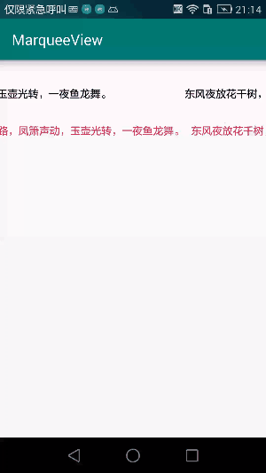

# MarqueeView
可以调节间距的TextView跑马灯

### GIF
  

## Gradle  
Step 1. Add it in your root build.gradle at the end of repositories:

```
allprojects {
	repositories {
		...
		maven { url 'https://jitpack.io' }
	}
}
```
Step 2. Add the dependency 


```
 dependencies {
     compile 'com.jyn.marqueeview:marqueetextview:1.0.0'
}
 ```

## Demo 
```
    <com.jyn.marqueetextview.MarqueeView
        android:id="@+id/marquee"
        android:layout_width="match_parent"
        android:layout_height="50dp"
        app:spacing="0dp"
        app:speed="1"
        app:textColor="@android:color/white"
        app:textSize="15sp">

    </com.jyn.marqueetextview.MarqueeView>
```

## attr  
 
 ```
  <declare-styleable name="MarqueeView">
        <attr name="textSize" format="dimension" />
        <attr name="textColor" format="color" />
        <attr name="speed" format="integer" />
        <attr name="spacing" format="dimension" />
    </declare-styleable>
 ```
 
 
### 设计思路
 
 简书 ：[https://www.jianshu.com/p/79a544ee7f66](https://www.jianshu.com/p/79a544ee7f66)
 
 ---
 如果对您有帮助的话，还请给个收藏或者star，谢谢！
 ---